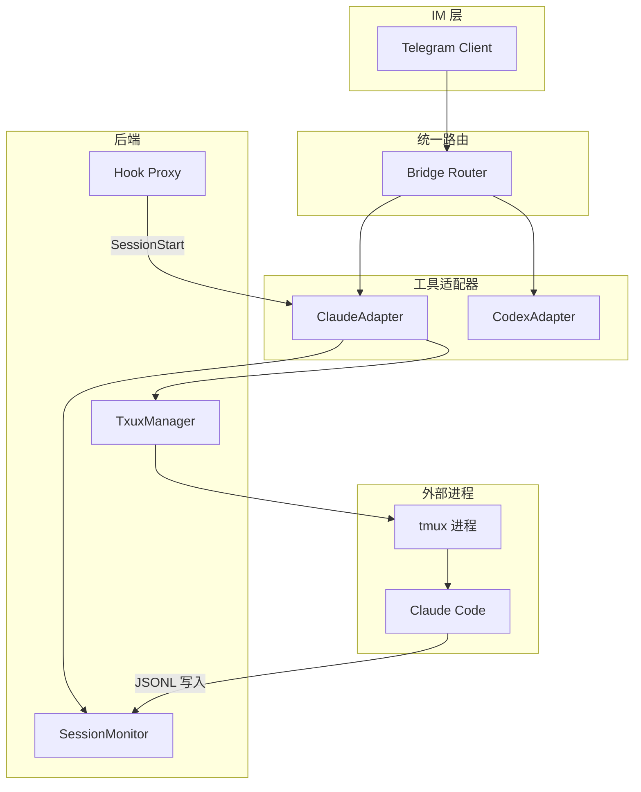

# Node.js 实现 ccbot 风格统一 IM-AI 桥接

## 可行性结论

**Node.js 可以实现**。核心能力均可通过现有能力完成：

| 能力       | Node 实现方式                                                     |
| -------- | ------------------------------------------------------------- |
| tmux 控制  | `child_process.exec('tmux send-keys -t target "text" Enter')` |
| JSONL 轮询 | `fs.promises.open` + 按字节偏移增量读取                                |
| Telegram | 已有 `node-telegram-bot-api`                                    |
| Topic 模式 | `sendMessage` 支持 `message_thread_id` 参数                       |

**平台限制**：tmux 仅支持 Linux/macOS；Windows 需 WSL。

---

## 架构设计



---

## 目录结构（增量）

```
src/
├── adapters/
│   ├── tool-adapter.interface.ts   # 工具适配器接口
│   ├── claude-adapter.ts           # Claude Code 适配器
│   └── codex-adapter.ts            # Codex 适配器 (Phase 2)
├── tmux/
│   ├── tmux-manager.ts             # tmux CLI 封装
│   └── tmux.types.ts
├── monitors/
│   ├── session-monitor.ts          # JSONL 轮询
│   └── transcript-parser.ts        # Claude/Codex JSONL 解析
├── core/
│   ├── router.ts                   # 重构：支持 OneShot 与 Tmux 双模式
│   └── ...
└── hooks/
    └── claude-hook.ts              # ccbot hook 子命令 (写 session_map)
```

---

## 核心模块设计

### 1. ToolAdapter 接口

```typescript
// src/adapters/tool-adapter.interface.ts
interface ToolAdapter {
  readonly toolId: 'claude' | 'codex';
  createSession(workDir: string, resumeId?: string): Promise<SessionHandle>;
  sendInput(handle: SessionHandle, text: string): Promise<void>;
  killSession(handle: SessionHandle): Promise<void>;
}

interface SessionHandle {
  windowId: string;   // tmux window id, e.g. '@12'
  sessionId: string;  // AI 工具内部的 session id
  workDir: string;
}
```

### 2. TmuxManager

- 封装 tmux 子进程调用：`list-windows`、`send-keys`、`capture-pane`、`new-window`、`kill-window`
- 使用 `child_process.exec` / `execSync`，返回 Promise
- 配置项：`TMUX_SESSION_NAME`（默认 `im-cli-bridge`）

### 3. SessionMonitor

- 轮询 `~/.claude/projects/*/` 下的 JSONL（或 Codex 的 `~/.codex/sessions/`）
- 依赖 `session_map.json`：window_id → session_id
- 按字节偏移增量读取，避免重复处理
- 解析 JSONL 行 → `NewMessage`，回调给 Router

### 4. ClaudeAdapter 实现

- 依赖 `TmuxManager` + `SessionMonitor` + `TranscriptParser`
- `createSession`: 调用 `tmux new-window`，在指定目录执行 `claude` 或 `claude --resume`
- `sendInput`: `tmux send-keys -t windowId "text" Enter`（注意与 ccbot 一样在 Enter 前加 500ms 延迟）
- Hook：提供 `im-cli-bridge hook` 子命令，写入 `session_map.json`，供 Claude 的 SessionStart 调用

### 5. TranscriptParser

- 解析 Claude JSONL 的 `assistant`、`user`、`tool_use`、`thinking` 等事件
- 输出统一的 `{ role, text, contentType, isComplete }` 结构

---

## 运行模式切换

| 模式      | 环境变量                | 行为                                   |
| ------- | ------------------- | ------------------------------------ |
| OneShot | `MODE=oneshot` 或未设置 | 当前逻辑：`claude -p "msg"` 每次 spawn      |
| Tmux    | `MODE=tmux`         | 使用 TmuxManager + SessionMonitor，常驻会话 |

---

## 会话模型

**Phase 1（推荐先做）**：私聊模式

- 1 个 Telegram 用户 = 1 个 tmux window = 1 个 Claude session
- 状态存储：`~/.im-cli-bridge/state.json`（user_id → window_id 映射）

**Phase 2**：Topic 模式（可选）

- 需 Forum 群组，1 Topic = 1 tmux window
- `message_thread_id` 作为 session 标识

---

## 实施阶段

### Phase 1：Claude tmux 模式（单用户）

1. 新增 `TmuxManager`：`listWindows`、`createWindow`、`sendKeys`、`killWindow`
2. 新增 `SessionMonitor`：轮询 `~/.claude/projects/` JSONL，字节偏移 + `TranscriptParser`
3. 新增 `ClaudeAdapter` 实现 `ToolAdapter`
4. 新增 `im-cli-bridge hook` 子命令，输出 `session_map.json`
5. 修改 Router：当 `MODE=tmux` 时走 `ClaudeAdapter`，否则走现有 OneShot
6. 更新 Message 流：`metadata.threadId` 支持 Topic，`userId` 作为 session 键（私聊）

### Phase 2：CodexAdapter

1. 实现 `CodexTranscriptParser`（解析 `~/.codex/sessions/` 下的 rollout-*.jsonl）
2. 实现 `CodexAdapter`，复用 TmuxManager
3. Codex 的 session 映射需单独调研（是否有 Hook 或可推断方式）

### Phase 3：Topic 模式（可选）

1. 扩展 Telegram 消息解析，支持 `message_thread_id`
2. 扩展 state 存储：thread_id → window_id
3. 发送消息时传入 `message_thread_id`

---

## 配置与依赖

**新增环境变量**（`.env.example`）：

```
MODE=tmux                    # oneshot | tmux
TMUX_SESSION_NAME=im-cli-bridge
MONITOR_POLL_INTERVAL=2
```

**新增依赖**：无。tmux 通过 CLI 调用，JSONL 用 `fs` 即可。

---
