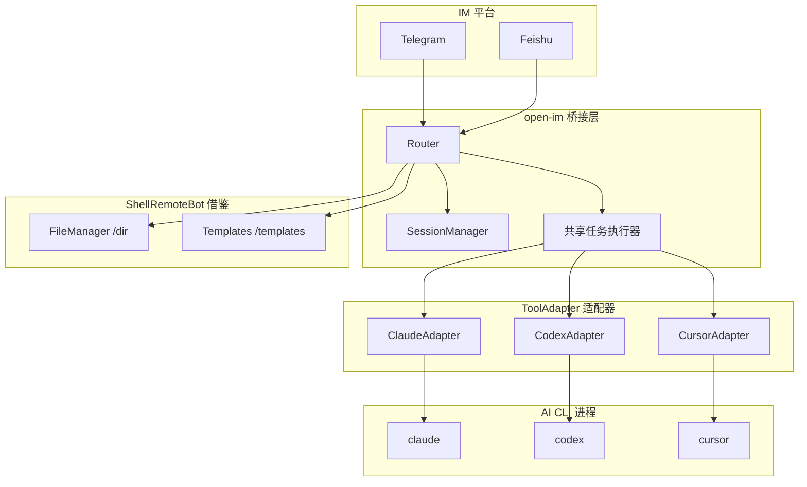

# open-im 多工具 IM-AI 桥接实现计划

参考 [cc-im](https://github.com/congqiu/cc-im) 实现支持多种 AI CLI 的 open-im 桥接。cc-im 仅支持 Claude Code CLI，本项目目标是在保留其优秀交互体验的前提下，通过适配器模式支持 Claude、Codex、Cursor 等多种工具。同时从 [ShellRemoteBot](https://github.com/Al-Muhandis/ShellRemoteBot) 借鉴可迁移的交互模式以增强 AI CLI 桥接体验。

---

## 一、cc-im 与 open-im 对比

| 维度 | cc-im | open-im（目标） |
|------|-------|-----------------|
| AI 工具 | 仅 Claude Code CLI | Claude、Codex、Cursor、可扩展 |
| 执行方式 | `spawn` + `--output-format stream-json` + `--resume` | 按工具选择：Claude 用 stream-json，Codex 等用各自输出格式 |
| 会话 | SessionManager + `--resume sessionId` | 每个 ToolAdapter 定义自己的 session 策略 |
| IM 平台 | 飞书 + Telegram | 同左 |
| 流式输出 | 节流更新、editMessage | 同左 |

cc-im 核心链路：`cli-runner.ts`（spawn claude）→ `stream-parser.ts`（解析 stream-json）→ `claude-task.ts`（节流、完成统计、竞态保护）→ 平台适配器（飞书 CardKit / Telegram editMessage）。

---

## 二、从 ShellRemoteBot 可借鉴的经验

ShellRemoteBot 是远程 Shell 控制 bot，以下能力可迁移到 AI CLI 桥接中增强体验：

| 能力 | ShellRemoteBot 做法 | 迁移到 AI CLI 桥接 |
|------|---------------------|--------------------|
| **文件管理器** | `/dir` + 内联按钮浏览目录、下载文件、上传 | 新增 `/dir`：浏览工作目录，下载 AI 生成文件（截图、产出物），上传文件供 AI 分析。与 cc-im 的「截图自动发送」互补，扩展为通用文件浏览/下载 |
| **脚本/快捷** | `/scripts` 列出 `.script` 文件，点击执行 | 新增 `/templates` 或 `/scripts`：预置 prompt 模板（如「代码审查」「重构建议」），点击即发送，减少重复输入 |
| **补读输出** | `/read` 读取 shell 中尚未推送的输出 | 新增 `/read` 或「刷新」：当流式输出丢失/中断时，可触发重取最近输出或任务状态 |
| **内联按钮** | 目录/文件/脚本用 callback 按钮选择 | 强化内联按钮：Stop、Allow/Deny 权限、重试、新会话等（cc-im 已有 Stop，可扩展） |
| **回复上传** | 在 FileManager 中回复文档即保存到路径 | 支持「回复某条消息并附文档」：将文件保存到工作目录并作为附件传给 AI（cc-im 已支持图片，可扩展为任意文档） |
| **用户权限** | `Users` 段：`user_id=a` 管理员、`user_id=b` 封禁 | 扩展白名单：支持 `BANNED_USER_IDS` 或配置中 `banned` 标记，与 cc-im 的 `ALLOWED_USER_IDS` 互补 |
| **简洁配置** | INI 文件，分区清晰 | 可选：在 JSON 配置外提供 INI 映射，便于非技术用户编辑 |

优先落地建议：**文件管理器 `/dir`** 和 **模板快捷 `/templates`** 对 AI CLI 工作流价值最高，可作为增强功能的优先实现。

---

## 三、架构设计



---

## 四、核心模块规划

### 4.1 ToolAdapter 接口（抽象层）

每个 AI CLI 实现一个适配器，统一接口：

```typescript
interface ToolAdapter {
  readonly toolId: string;  // 'claude' | 'codex' | 'cursor'
  run(prompt: string, sessionId: string | undefined, workDir: string, callbacks: RunCallbacks, options?: RunOptions): RunHandle;
  parseLine(line: string): ParsedEvent | null;
}
```

- **ClaudeAdapter**：参考 cc-im 的 `cli-runner` 和 `stream-parser`
- **CodexAdapter**：按 Codex CLI 接口实现
- **CursorAdapter**：按 Cursor CLI 接口实现

### 4.2 共享任务执行层（参考 claude-task.ts）

抽象出 `runAITask(deps, ctx, prompt, adapter, platformAdapter)`：

- 注入 `ToolAdapter`，由配置的 `AI_COMMAND` 决定用哪个 adapter
- 节流更新、思考过程展示、工具调用通知、完成统计、竞态保护
- 平台适配器接口：`streamUpdate`、`sendComplete`、`sendError`、`throttleMs`

### 4.3 增强模块（借鉴 ShellRemoteBot）

- **FileManager**：`/dir [path]`，内联按钮浏览目录、下载文件、上传入口；回复文档保存到当前路径
- **Templates**：`/templates` 或 `/scripts`，预置 prompt 模板，内联按钮点击发送

---

## 五、实现步骤

### 阶段 1：统一 ToolAdapter 与 Claude 实现

1. 定义 `ToolAdapter` 接口及 `RunCallbacks`、`RunHandle`、`ParsedEvent` 等类型
2. 从 cc-im 移植/改写 `stream-parser` 逻辑到 `ClaudeAdapter`
3. 将 cli-runner 风格逻辑封装为 `ClaudeAdapter.run()`
4. 在 Router/主流程中通过 `AdapterRegistry.get(config.aiCommand)` 获取 adapter 并调用

### 阶段 2：共享任务执行层

1. 抽取 `runAITask`，参数包含 `ToolAdapter` 和平台 `TaskAdapter`
2. 实现节流、思考过程、工具调用通知、完成 note 构建
3. 将 Telegram / 飞书的消息发送逻辑实现为 `TaskAdapter`

### 阶段 3：Codex / Cursor 适配器

1. 新建 `CodexAdapter`、`CursorAdapter`，实现 `run()` 与 `parseLine()`
2. 配置各工具专用参数

### 阶段 4：ShellRemoteBot 借鉴增强（可选）

1. **FileManager**：实现 `/dir`，内联键盘目录/文件/上传，回调处理
2. **Templates**：实现 `/templates`，扫描模板目录，内联按钮发送 prompt
3. **/read**：任务输出补读或状态刷新
4. **BANNED_USER_IDS**：扩展访问控制

### 阶段 5：飞书集成

1. 按 cc-im 方式集成飞书长连接
2. 复用同一套 `runAITask` + `TaskAdapter`

### 阶段 6：精简与发布

1. 统一配置路径 `~/.im-cli-bridge/`
2. 更新 README：npx 引导、多工具说明、ShellRemoteBot 借鉴致谢

---

## 六、关键文件与引用

- cc-im 参考：[cli-runner.ts](https://github.com/congqiu/cc-im/blob/main/src/claude/cli-runner.ts)、[claude-task.ts](https://github.com/congqiu/cc-im/blob/main/src/shared/claude-task.ts)、[stream-parser.ts](https://github.com/congqiu/cc-im/blob/main/src/claude/stream-parser.ts)
- ShellRemoteBot 参考：[shellthread.pas](https://github.com/Al-Muhandis/ShellRemoteBot/blob/master/src/shellthread.pas)（/dir 内联键盘、/scripts、callback 流程）
- 本项目：`src/adapters/*`、`src/shared/ai-task.ts`、`src/shell/file-manager.ts`（借鉴）、`src/shell/templates.ts`（借鉴）
