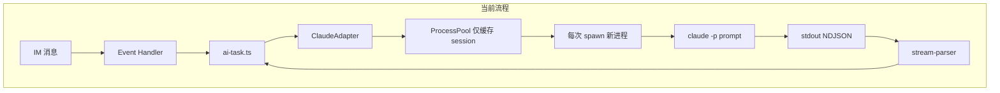
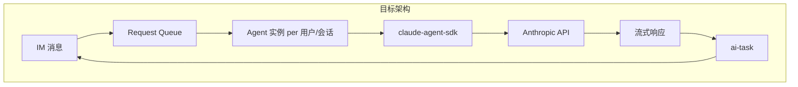

# 进程模型优化路线图

## 当前架构

每次请求都会冷启动 Claude CLI，导致首轮响应慢（约 3–8 秒）。

---

## 推荐路线：分阶段实施

### 阶段一：短期优化（方案 D）— 建议优先

**目标**：在不改架构的前提下，缩短单次冷启动时间。

**改动**：

1. **去掉 `--verbose`**

- 位置：`[src/claude/cli-runner.ts](src/claude/cli-runner.ts)` 第 62 行、`[src/claude/process-pool.ts](src/claude/process-pool.ts)` 第 137 行  
- 减少 stderr 输出，降低 I/O 和解析开销

1. **可选：支持精简配置加载**

- 通过环境变量或 `--setting-sources` 限制 Claude 加载的配置范围（若 CLI 支持）  
- 需查阅 Claude Code CLI 文档确认

1. **stderr 截断（参考 cc-im）**

- 在 cli-runner 中只保留 stderr 首 4KB + 尾 6KB，减少内存和日志处理

**预期收益**：首轮响应可缩短约 0.5–1 秒，改动小、风险低。

---

### 阶段二：中期验证（方案 B）— 需先验证

**目标**：确认 Claude CLI 是否支持「单进程 + stdin 持续接收多轮消息」。

**步骤**：

1. **编写验证脚本**

- 使用 `claude -p --input-format stream-json --output-format stream-json`  
- 通过 stdin 连续发送多条 NDJSON 消息，观察是否能在同一进程中处理多轮对话

1. **若验证通过**

- 实现「单进程 + stdin 队列」模式  
- 每用户/会话维护一个长期进程，新消息写入 stdin 队列  
- 需处理进程崩溃、超时、`/new` 重置等边界情况

**风险**：CLI 可能不支持该用法，需先验证再投入开发。

---

### 阶段三：长期迁移（方案 A）— 体验最佳

**目标**：用 `@anthropic-ai/claude-agent-sdk` 的 Streaming Input 模式，在进程内维持长连接 Agent。

**架构变化**：

**主要工作**：

1. **引入依赖**

- `npm install @anthropic-ai/claude-agent-sdk`

1. **新建 Agent 适配器**

- 新建 `src/adapters/agent-sdk-adapter.ts`  
- 每用户/会话维护一个 Agent 实例，通过 `query({ prompt: AsyncGenerator })` 持续喂入消息

1. **权限集成**

- 使用 SDK 的 `PreToolUse` hook  
- 在 hook 中调用现有 permission-server 逻辑：发送卡片、等待用户点击、返回 allow/deny

1. **配置切换**

- 在 config 中增加 `useAgentSdk: boolean`  
- registry 根据配置选择 `ClaudeAdapter`（CLI）或 `AgentSdkAdapter`（SDK）

**优点**：无冷启动、多轮复用、官方 SDK、体验最好。  
**缺点**：需重构 adapter、处理权限与会话生命周期。

---

## 决策建议

| 阶段  | 方案  | 投入              | 收益     | 建议         |
| --- | --- | --------------- | ------ | ---------- |
| 一   | D   | 1–2 天           | 中等     | **立即做**    |
| 二   | B   | 1 天验证 + 3–5 天实现 | 高（若可行） | **先验证再决定** |
| 三   | A   | 1–2 周           | 最高     | **作为长期目标** |

**推荐执行顺序**：

1. 先完成阶段一（方案 D），快速见效。
2. 并行做阶段二验证脚本，确认 CLI stdin 多轮能力。
3. 若方案 B 不可行，再规划阶段三（方案 A）的详细设计与排期。

---

## 已完成优化

- **节流常量**：已与 cc-im 对齐（飞书 80ms、Telegram 200ms），流式观感已改善。
